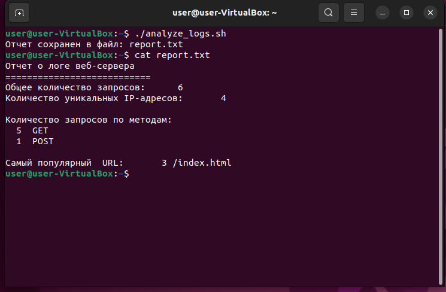

# Анализ логов с сервера с помощью скрипта bash, генерация текстового отчета.

## Технологический стек:
Bash, awk, Linux.  

## Исходные данные:
Файл access.log с запросами к серверу

## Функционал скрипта:
Подсчитывает общее количество запросов.  
Подсчитывает количество уникальных IP-адресов.  
Подсчитывает количество запросов по методам (GET, POST и т.д.).  
Находит самый популярный URL.  
Создает отчет в виде текстового файла.  

## Файлы и папки в репозитории:
access.log - лог файл.  
analyze_logs.sh  - скрипт, выполняющий обработку логов.  
report.txt   -  пример текстового отчета, создаваемого скриптом.   

